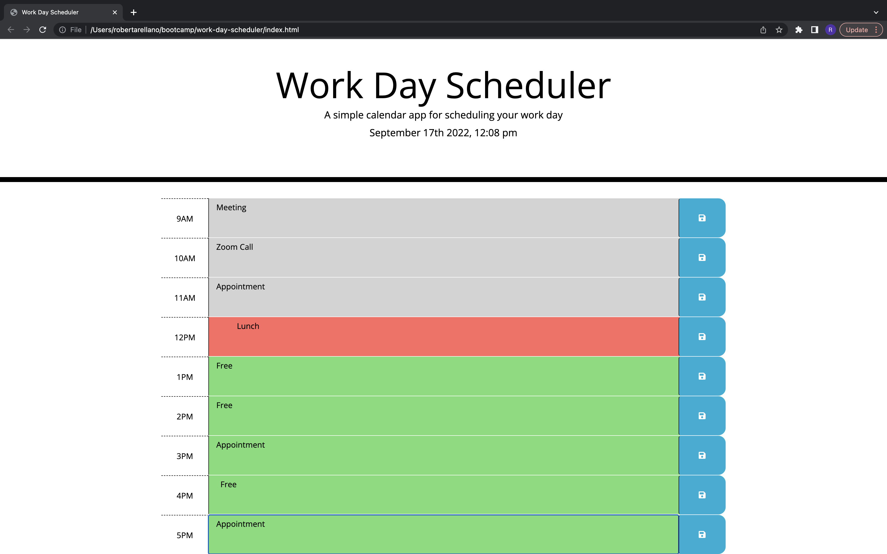

# Work-Day-Scheduler

## Description
This work day scheduler allows the user to view a work day schedule from the hours of 9:00AM-5:00PM. This work day schedule will allow the user to save events within the time-blocks displayed. The user also has the capability to save the event using the save button on each time-block. If the user closes the page and reopens it the event will persist and display the last event that was entered. 

## User Story
* AS AN employee with a busy schedule
* I WANT to add important events to a daily planner
* SO THAT I can manage my time effectively

# Acceptance Criteria
* GIVEN I am using a daily planner to create a schedule
* WHEN I open the planner
* THEN the current day is displayed at the top of the calendar
* WHEN I scroll down
* THEN I am presented with timeblocks for standard business hours
* WHEN I view the timeblocks for that day
* THEN each timeblock is color coded to indicate whether it is in the past, present, or future
* WHEN I click into a timeblock
* THEN I can enter an event
* WHEN I click the save button for that timeblock
* THEN the text for that event is saved in local storage
* WHEN I refresh the page
* THEN the saved events persist

# Usage 
* If the user views the top of the page they will be able to view the current day and time (this was acomplished using moment.js).
* The time-blocks displayed function in a color coordinated color scheme Past-time = Grey, Present-time = Red, Future-time = Green. 
* Events can be entered within the text area. 
* Events can then be saved by clicking on the save button on the right hand side of the time-block. 
* These events will be saved to local storage. 
* When the webpage is reloaded these events will persist in the time-blocks that they were entered in. 
* The user will need to delete and click the save button in order to clear the event from the time-block. 

# Screenshot

## Git Pages Link 

## License
MIT License

Copyright (c) 2022 Robert
